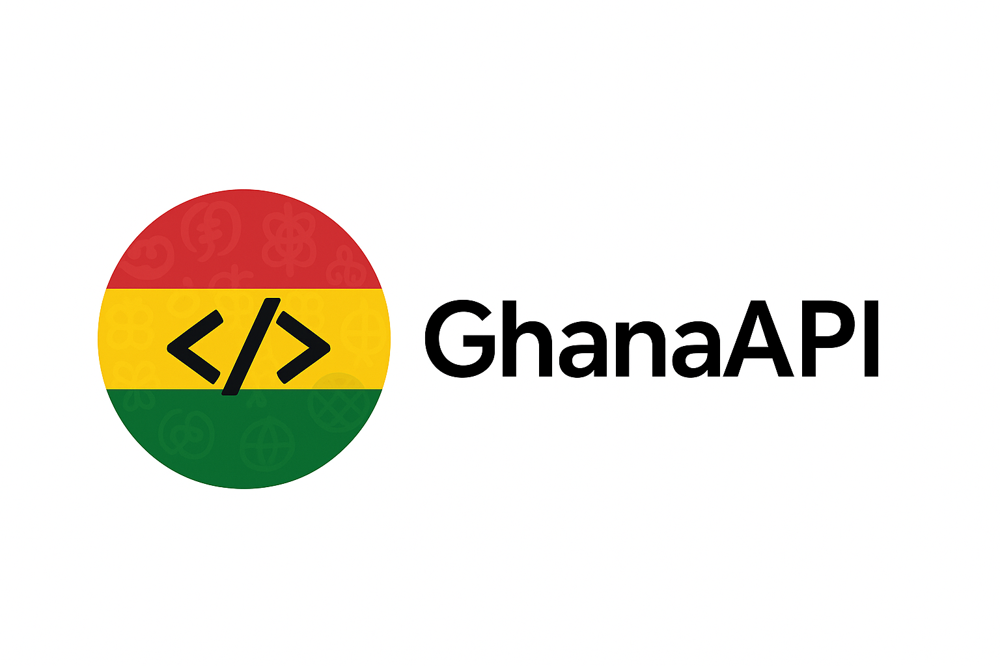

# 🇬🇭 GhanaAPI

<div align="center">
  
</div>

[](https://api.ghana-api.dev)
[](https://github.com/teebhagg/ghanaapi/releases)
[](https://opensource.org/licenses/MIT)
[](https://codecov.io/gh/teebhagg/ghanaapi)

> **The definitive REST API for Ghanaian services** - Addresses, Exchange Rates, Locations, Transport & Logistics, and more. Built for developers who need reliable access to essential Ghanaian data and services.

🌐 **[API Documentation](https://api.ghana-api.dev/docs)** | 🚀 **[Getting Started](https://docs.ghana-api.dev)** | 💻 **[Examples](#examples)** | 📖 **[Contributing](#contributing)**

---

## 🎯 **What is GhanaAPI?**

GhanaAPI provides developers with unified, reliable access to essential Ghanaian services through a modern REST API. Instead of integrating with multiple fragmented services, developers can access everything through one comprehensive, well-documented API.

### **🔥 Key Features**

- **📍 Address & Location Services** - Ghana Post Digital Address validation, geocoding, and location lookup
- **🏦 Bank & ATM Locator** - Find banks and ATMs across Ghana with location-based search
- **� Stock Market Data** - Real-time Ghana Stock Exchange (GSE) data with market analytics and trends
- **�💱 Live Exchange Rates** - Real-time GHS exchange rates with historical data and trends
- **🏛️ Government Data** - Regional information, districts, and official datasets
- **🚗 Transport & Logistics** - Route planning, transport stops, fuel prices, and travel cost estimation
- **⚡ High Performance** - Sub-200ms response times with intelligent caching
- **📊 Developer Friendly** - Interactive Swagger docs

---

## 🚀 **Getting Started**

### **Quick Example**

```javascript
// Get current USD to GHS exchange rate
const response = await fetch(
  "https://api.ghana-api.dev/v1/exchange-rates/current?currencies=USD"
);
const data = await response.json();
console.log(`1 USD = ${data.rates.USD.rate} GHS`);

// Get real-time stock market data
const stocks = await fetch(
  "https://api.ghana-api.dev/v1/stock-market/search?limit=10"
);
const stockData = await stocks.json();
console.log(
  `GCB Bank: ₵${stockData.data[0].price} (${stockData.data[0].changePercent}%)`
);

// Validate Ghana Post Digital Address
const address = await fetch(
  "https://api.ghana-api.dev/v1/addresses/validate/GA-123-4567"
);
const validation = await address.json();
console.log(`Address is ${validation.isValid ? "valid" : "invalid"}`);

// Calculate route between two locations
const route = await fetch(
  "https://api.ghana-api.dev/v1/transport/route-calculation?start_lat=5.6037&start_lng=-0.187&end_lat=6.6885&end_lng=-1.6244"
);
const routeData = await route.json();
console.log(
  `Distance: ${routeData.data.distance}km, Duration: ${
    routeData.data.duration / 60
  }min`
);
```

### **Base URL**

```
https://api.ghana-api.dev/v1
```

---

## 📚 **API Reference**

### **🏠 Address & Location Services**

#### **Validate Digital Address**

```http
GET /v1/addresses/validate/{digitalCode}
```

**Example:**

```bash
curl "https://api.ghana-api.dev/v1/addresses/validate/GA-123-4567"
```

**Response:**

```json
{
  "isValid": true,
  "digitalCode": "GA-123-4567",
  "formattedAddress": "123 Liberation Road, Accra, Greater Accra Region",
  "coordinates": {
    "latitude": 5.6037,
    "longitude": -0.187
  },
  "region": "Greater Accra Region",
  "district": "Accra Metropolitan"
}
```

#### **Reverse Geocoding**

```http
GET /v1/addresses/lookup?lat={latitude}&lng={longitude}
```

**Example:**

```bash
curl "https://api.ghana-api.dev/v1/addresses/lookup?lat=5.6037&lng=-0.1870"
```

#### **Address Search**

```http
GET /v1/addresses/search?q={query}&limit={limit}
```

**Example:**

```bash
curl "https://api.ghana-api.dev/v1/addresses/search?q=University%20of%20Ghana&limit=5"
```

### **🏦 Banking & ATM Locator Services**

#### **Search Banks and ATMs**

```http
GET /v1/banking/search?q={query}&lat={lat}&lng={lng}&radius={radius}&type={type}&limit={limit}
```

**Example:**

```bash
curl "https://api.ghana-api.dev/v1/banking/search?q=GCB&limit=10"
```

**Location-based search:**

```bash
curl "https://api.ghana-api.dev/v1/banking/nearby?lat=5.6037&lng=-0.187&radius=5&limit=10"
```

**Response:**

```json
{
  "success": true,
  "data": [
    {
      "id": "gcb-head-office",
      "name": "GCB Bank Limited - Head Office",
      "type": "bank",
      "code": "GCB",
      "address": "Thorpe Road, Accra",
      "city": "Accra",
      "region": "Greater Accra",
      "latitude": 5.6037,
      "longitude": -0.187,
      "phone": "+233302664910",
      "website": "https://www.gcbbank.com.gh",
      "operatingHours": "Mon-Fri: 8:00-17:00, Sat: 8:00-13:00",
      "services": ["ATM", "Cash Deposit", "Foreign Exchange", "Loans"],
      "distance": 0.1
    }
  ],
  "total": 1,
  "source": "OpenStreetMap + Static Directory"
}
```

#### **Get Banks by Region**

```http
GET /v1/banking/region/{region}
```

**Example:**

```bash
curl "https://api.ghana-api.dev/v1/banking/region/Greater%20Accra"
```

### **� Stock Market Data Services**

#### **Search Stocks**

```http
GET /v1/stock-market/search?q={query}&limit={limit}&sector={sector}&sort={sort}
```

**Example:**

```bash
curl "https://api.ghana-api.dev/v1/stock-market/search?limit=10&sector=Banking"
```

**Response:**

```json
{
  "success": true,
  "data": [
    {
      "symbol": "GCB",
      "name": "GCB Bank Limited",
      "price": 4.25,
      "change": 0.15,
      "changePercent": 3.66,
      "volume": 125000,
      "marketCap": 2800000000,
      "sector": "Banking",
      "status": "ACTIVE",
      "lastUpdated": "2025-01-15T15:30:00Z"
    }
  ],
  "total": 25,
  "source": "Ghana Stock Exchange API"
}
```

#### **Get Stock by Symbol**

```http
GET /v1/stock-market/stocks/{symbol}
```

**Example:**

```bash
curl "https://api.ghana-api.dev/v1/stock-market/stocks/GCB"
```

#### **Get Market Summary**

```http
GET /v1/stock-market/summary
```

**Example:**

```bash
curl "https://api.ghana-api.dev/v1/stock-market/summary"
```

**Response:**

```json
{
  "success": true,
  "data": {
    "totalStocks": 45,
    "activeStocks": 42,
    "gainers": 15,
    "losers": 12,
    "unchanged": 15,
    "totalMarketCap": 75000000000,
    "totalVolume": 2500000,
    "lastUpdated": "2025-01-15T15:30:00Z"
  },
  "source": "Ghana Stock Exchange API"
}
```

#### **Get Stock Sectors**

```http
GET /v1/stock-market/sectors
```

**Example:**

```bash
curl "https://api.ghana-api.dev/v1/stock-market/sectors"
```

### **�💱 Exchange Rate Services**

#### **Current Exchange Rates**

```http
GET /v1/exchange-rates/current?currencies={currencies}
```

**Example:**

```bash
curl "https://api.ghana-api.dev/v1/exchange-rates/current?currencies=USD,EUR,GBP"
```

**Response:**

```json
{
  "baseCurrency": "GHS",
  "timestamp": "2025-01-15T10:30:00Z",
  "rates": {
    "USD": {
      "rate": 0.082,
      "inverseRate": 12.2,
      "change24h": -0.15,
      "trend": "down"
    },
    "EUR": {
      "rate": 0.076,
      "inverseRate": 13.16,
      "change24h": 0.08,
      "trend": "up"
    }
  },
  "provider": "Bank of Ghana",
  "nextUpdate": "2025-01-15T11:00:00Z"
}
```

#### **Historical Exchange Rates**

```http
GET /v1/exchange-rates/historical?currency={currency}&from={date}&to={date}
```

**Example:**

```bash
curl "https://api.ghana-api.dev/v1/exchange-rates/historical?currency=USD&from=2025-01-01&to=2025-01-15"
```

### **🌍 Location Data**

#### **Get All Regions**

```http
GET /v1/locations/regions
```

#### **Get Districts by Region**

```http
GET /v1/locations/regions/{regionId}/districts
```

**Example:**

```bash
curl "https://api.ghana-api.dev/v1/locations/regions/1/districts"
```

### **🚗 Transport & Logistics**

#### **Calculate Route**

```http
GET /v1/transport/route-calculation?start_lat={lat}&start_lng={lng}&end_lat={lat}&end_lng={lng}&mode={mode}
```

**Example:**

```bash
curl "https://api.ghana-api.dev/v1/transport/route-calculation?start_lat=5.6037&start_lng=-0.187&end_lat=6.6885&end_lng=-1.6244&mode=driving"
```

**Response:**

```json
{
  "success": true,
  "data": {
    "distance": 247.8,
    "duration": 10800,
    "coordinates": [
      [5.6037, -0.187],
      [6.6885, -1.6244]
    ],
    "instructions": [
      "Head north on Liberation Road",
      "Continue for 247 km to Kumasi"
    ]
  },
  "start": [5.6037, -0.187],
  "end": [6.6885, -1.6244],
  "mode": "driving"
}
```

#### **Get Transport Stops**

```http
GET /v1/transport/stops?city={city}&type={type}
```

**Example:**

```bash
curl "https://api.ghana-api.dev/v1/transport/stops?city=accra&type=bus_stop"
```

#### **Get Current Fuel Prices**

```http
GET /v1/transport/fuel-prices
```

**Example:**

```bash
curl "https://api.ghana-api.dev/v1/transport/fuel-prices"
```

**Response:**

```json
{
  "success": true,
  "data": {
    "petrol": 6.5,
    "diesel": 6.85,
    "lpg": 4.2,
    "currency": "GHS",
    "lastUpdated": "2024-01-15T08:00:00Z",
    "source": "National Petroleum Authority"
  }
}
```

---

## 🤝 **Contributing**

We welcome contributions from the developer community! Here's how you can help:

### **Getting Started**

1. **Fork** the repository
2. **Create** a feature branch (`git checkout -b feature/amazing-feature`)
3. **Make** your changes
4. **Add** tests for new functionality
5. **Run** the test suite (`npm test`)
6. **Commit** your changes (`git commit -m 'Add amazing feature'`)
7. **Push** to the branch (`git push origin feature/amazing-feature`)
8. **Open** a Pull Request

### **Development Setup**

```bash
# Fork and clone
git clone https://github.com/teebhagg/GhanaAPI.git
cd backend

# Install dependencies
npm install

# Set up development environment
cp .env .env.development

# Start development server with hot reload
npm run start:dev

# Run tests in watch mode
npm run test:watch
```

### **Contribution Guidelines**

- **Code Style:** We use Prettier and ESLint
- **Tests:** All new features must include tests
- **Documentation:** Update README and API docs for new features
- **Commit Messages:** Use conventional commit format
- **Issues:** Use our issue templates for bugs and feature requests

### **Detailed Contributing Guides**

We have comprehensive guides for each service area:

📈 **[Stock Market Data](https://docs.ghana-api.dev/docs/contributing/stock-market)** - GSE integration and real-time data
📍 **[Address Services](https://docs.ghana-api.dev/docs/contributing/addresses)** - Ghana Post Digital Address validation  
🏦 **[Banking & ATMs](https://docs.ghana-api.dev/docs/contributing/banking)** - Bank and ATM location services
💱 **[Exchange Rates](https://docs.ghana-api.dev/docs/contributing/exchange-rates)** - Currency data integration
🚗 **[Transport & Logistics](https://docs.ghana-api.dev/docs/contributing/transport)** - Route planning and fuel prices
🏛️ **[Location Data](https://docs.ghana-api.dev/docs/contributing/locations)** - Regional and administrative data

**[📖 View Full Contributing Guide →](https://docs.ghana-api.dev/docs/contributing/overview)**

### **Areas We Need Help**

- 🐛 **Bug fixes** and performance improvements
- 📚 **Documentation** improvements and translations
- 🧪 **Test coverage** expansion
- 🔌 **New integrations** with Ghanaian services
- 🌍 **Localization** for local languages
- 📱 **SDK development** for more programming languages

---

## 📄 **License**

This project is licensed under the **MIT License** - see the [LICENSE](LICENSE) file for details.

### **What this means:**

- ✅ **Commercial use** allowed
- ✅ **Modification** allowed
- ✅ **Distribution** allowed
- ✅ **Private use** allowed
- ❌ **Warranty** not provided
- ❌ **Liability** not accepted

---

## 🙏 **Acknowledgments**

Special thanks to:

- **Bank of Ghana** for providing official exchange rate data
- **Ghana Stock Exchange (GSE)** for real-time stock market data and trading information
- **Ghana Statistical Service** for regional and demographic data
- **OpenStreetMap Ghana community** for mapping data
- **All contributors** who help make this project better

---

## 🌟 **Star History**

[](https://star-history.com/#teebhagg/GhanaAPI&Date)

---

<div align="center">

**Built with ❤️ for the Ghanaian developer community**

[Website](https://ghana-api.dev) • [Documentation](https://docs.ghana-api.dev) • [Status](https://status.ghana-api.dev) • [LinkedIn](https://www.linkedin.com/in/joshua-ansah-b0a15a230/)

**Made in Ghana 🇬🇭**

</div>
